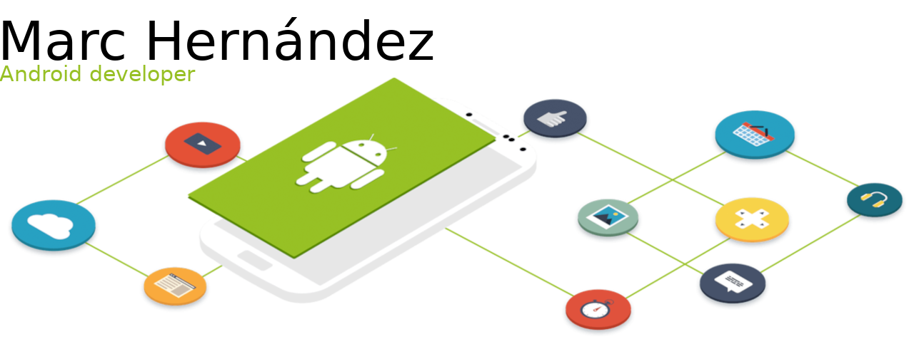

<!-- Icon & intro -->
<h1 align="left">
  <picture>
    <source media="(prefers-color-scheme: dark)" srcset="./hi_android_robot.png" height="25">
    
  </picture>
  Hello, I am...
</h1>

<!-- Header picture -->
<picture>
  <source media="(prefers-color-scheme: dark)" srcset="./dark_mode_header.png">
  
</picture>

<!-- Text only -->
Software developer specialized in native Android development (both with XML views and Jetpack Compose) and cross-platform development with Compose Multiplatform and Kotlin Multiplatform.

<!-- Skills -->
## Skills:

<!-- Android -->
<a>
  <picture>
    <source media="(prefers-color-scheme: dark)" srcset="https://img.shields.io/badge/-Android-333333?style=plastic&logo=android" height="22">
    
  </picture>
</a>
&nbsp;
<!-- Android Studio -->
<a>
  <picture>
    <source media="(prefers-color-scheme: dark)" srcset="https://img.shields.io/badge/-Android%20Studio-333333?style=plastic&logo=android-studio&logoColor=34a853" height="22">
    
  </picture>
</a>
&nbsp;
<!-- Kotlin -->
<a>
  <picture>
    <source media="(prefers-color-scheme: dark)" srcset="https://img.shields.io/badge/-Kotlin-333333?style=plastic&logo=kotlin" height="22">
    
  </picture>
</a>
&nbsp;
<!-- Java -->
<a>
  <picture>
    <source media="(prefers-color-scheme: dark)" srcset="https://img.shields.io/badge/-Java-333333?style=plastic&logo=openjdk" height="22">
    
  </picture>
</a>
&nbsp;
<!-- Gradle -->
<a>
  <picture>
    <source media="(prefers-color-scheme: dark)" srcset="https://img.shields.io/badge/-Gradle-333333?style=plastic&logo=gradle" height="22">
    
  </picture>
</a>
&nbsp;

<!-- Jetpack Compose -->
<a>
  <picture>
    <source media="(prefers-color-scheme: dark)" srcset="https://img.shields.io/badge/-Jetpack%20Compose-333333?style=plastic&logo=jetpackcompose" height="22">
    
  </picture>
</a>
&nbsp;
<!-- Compose Multiplatform -->
<a>
  <picture>
    <source media="(prefers-color-scheme: dark)" srcset="https://img.shields.io/badge/-Compose%20Multiplatform-333333?style=plastic&logo=jetpackcompose" height="22">
    
  </picture>
</a>
&nbsp;
<!-- Kotlin Multiplatform -->
<a>
  <picture>
    <source media="(prefers-color-scheme: dark)" srcset="https://img.shields.io/badge/-Kotlin%20Multiplatform-333333?style=plastic&logo=kotlin" height="22">
    
  </picture>
</a>
&nbsp;

<!-- Hilt -->
<a>
  <picture>
    <source media="(prefers-color-scheme: dark)" srcset="https://img.shields.io/badge/-Hilt-333333?style=plastic" height="22">
    
  </picture>
</a>
&nbsp;
<!-- Koin -->
<a>
  <picture>
    <source media="(prefers-color-scheme: dark)" srcset="https://img.shields.io/badge/-Koin-333333?style=plastic" height="22">
    
  </picture>
</a>
&nbsp;
<!-- Room -->
<a>
  <picture>
    <source media="(prefers-color-scheme: dark)" srcset="https://img.shields.io/badge/-Room-333333?style=plastic" height="22">
    
  </picture>
</a>
&nbsp;
<!-- OkHttp -->
<a>
  <picture>
    <source media="(prefers-color-scheme: dark)" srcset="https://img.shields.io/badge/-OkHttp-333333?style=plastic" height="22">
    
  </picture>
</a>
&nbsp;
<!-- Retrofit -->
<a>
  <picture>
    <source media="(prefers-color-scheme: dark)" srcset="https://img.shields.io/badge/-Retrofit-333333?style=plastic" height="22">
    
  </picture>
</a>
&nbsp;
<!-- Ktor -->
<a>
  <picture>
    <source media="(prefers-color-scheme: dark)" srcset="https://img.shields.io/badge/-Ktor-333333?style=plastic&logo=ktor" height="22">
    
  </picture>
</a>
&nbsp;
<!-- Picasso -->
<a>
  <picture>
    <source media="(prefers-color-scheme: dark)" srcset="https://img.shields.io/badge/-Picasso-333333?style=plastic" height="22">
    
  </picture>
</a>
&nbsp;
<!-- Glide -->
<a>
  <picture>
    <source media="(prefers-color-scheme: dark)" srcset="https://img.shields.io/badge/-Glide-333333?style=plastic" height="22">
    
  </picture>
</a>
&nbsp;
<!-- Coil -->
<a>
  <picture>
    <source media="(prefers-color-scheme: dark)" srcset="https://img.shields.io/badge/-Coil-333333?style=plastic" height="22">
    
  </picture>
</a>
&nbsp;

<!-- Git -->
<a>
  <picture>
    <source media="(prefers-color-scheme: dark)" srcset="https://img.shields.io/badge/-Git-333333?style=plastic&logo=git" height="22">
    
  </picture>
</a>
&nbsp;
<!-- GitHub -->
<a>
  <picture>
    <source media="(prefers-color-scheme: dark)" srcset="https://img.shields.io/badge/-GitHub-333333?style=plastic&logo=github" height="22">
    
  </picture>
</a>
&nbsp;
<!-- GitLab -->
<a>
  <picture>
    <source media="(prefers-color-scheme: dark)" srcset="https://img.shields.io/badge/-GitLab-333333?style=plastic&logo=gitlab" height="22">
    
  </picture>
</a>
&nbsp;

<!-- Confluence -->
<a>
  <picture>
    <source media="(prefers-color-scheme: dark)" srcset="https://img.shields.io/badge/-Confluence-333333?style=plastic&logo=confluence&logoColor=136be6" height="22">
    
  </picture>
</a>
&nbsp;
<!-- Postman -->
<a>
  <picture>
    <source media="(prefers-color-scheme: dark)" srcset="https://img.shields.io/badge/-Postman-333333?style=plastic&logo=postman" height="22">
    
  </picture>
</a>
&nbsp;

<!-- Contact me -->
## Contact me:

<!-- Email -->
<a href="mailto:marc.hernandez.dev@gmail.com">
  <picture>
    <source media="(prefers-color-scheme: dark)" srcset="https://img.shields.io/badge/Email-marc.hernandez.dev@gmail.com-informational?style=plastic&logo=gmail&color=2f80ed" height="22">
    
  </picture>
</a>
&nbsp;
<!-- Linkedin -->
<a href="https://www.linkedin.com/in/marc-hernandez-armengod/">
  <picture>
    <source media="(prefers-color-scheme: dark)" srcset="https://img.shields.io/badge/LinkedIn-in%2Fmarc%E2%80%93hernandez%E2%80%93armengod-informational?style=plastic&logo=linkedin&logoColor=2f80ed&color=2f80ed" height="22">
    
  </picture>
</a>

<!-- Stats -->
## Stats:
<!-- GitHub stats - dark & clear -->
<a>
  <picture>
    <source media="(prefers-color-scheme: dark)" srcset="https://github-readme-stats.vercel.app/api?username=marchdz&show_icons=true&theme=github_dark_dimmed&rank_icon=github&hide=stars&bg_color=0d1117&text_color=FFFFFF">
    
  </picture>
</a>
&nbsp;
<!-- Top langs - dark & clear -->
<a>
  <picture>
    <source media="(prefers-color-scheme: dark)" srcset="https://github-readme-stats.vercel.app/api/top-langs/?username=marchdz&layout=compact&theme=github_dark_dimmed&bg_color=0d1117&text_color=FFFFFF">
    
  </picture>
</a>
